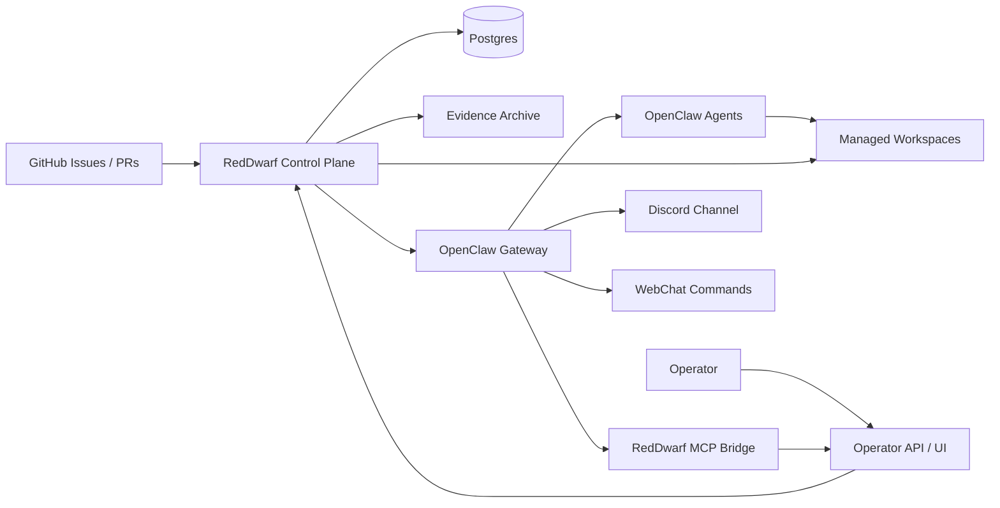
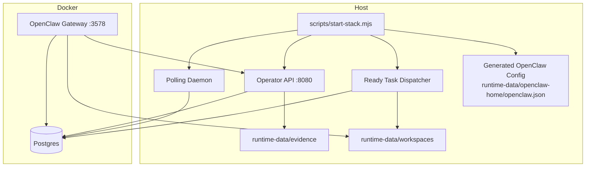
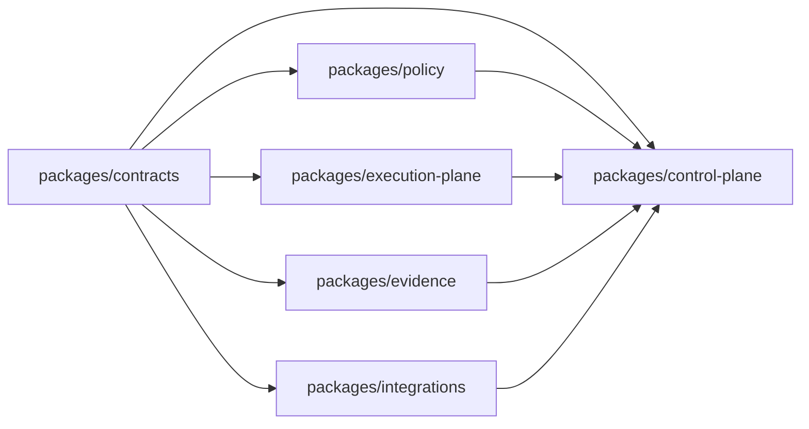
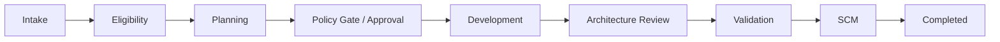
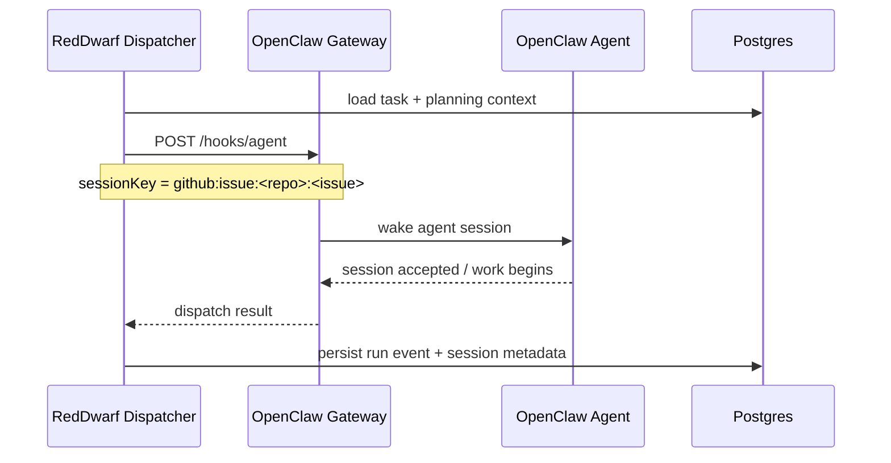
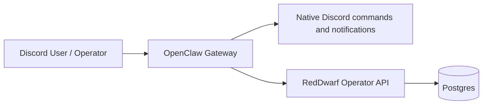
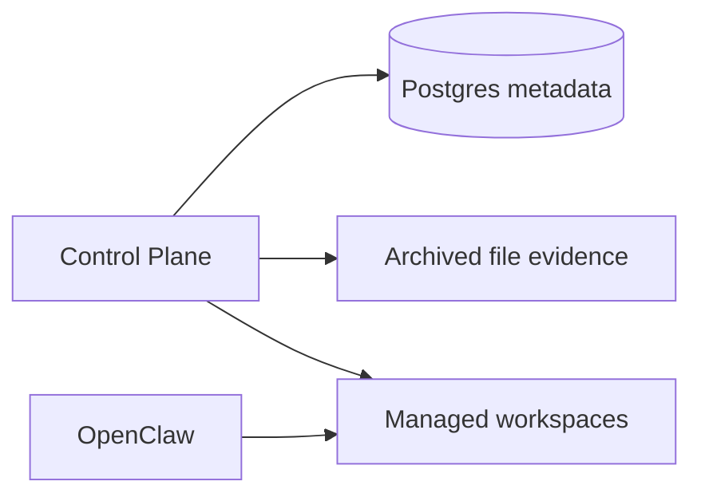
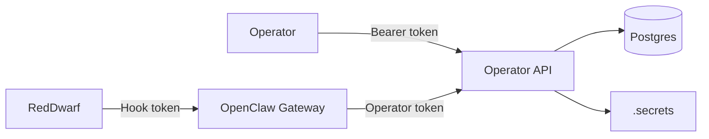

# RedDwarf Architecture

This document describes the current RedDwarf architecture as implemented in the repository today.

RedDwarf is an AI delivery control plane built around OpenClaw. The core architectural split is deliberate:

- RedDwarf owns domain logic: task intake, eligibility, planning, policy, approvals, orchestration, evidence, and operator workflows.
- OpenClaw owns runtime infrastructure: agent sessions, gateway, command surfaces, browser access, Discord integration, MCP hosting, and webhook-based agent dispatch.
- Postgres is the durable system of record for task state, approvals, pipeline runs, evidence metadata, operator config, and observability.

## 1. Design Principles

- Planning-first and audit-first. Every task should leave behind a plan, policy decision, evidence trail, and run history.
- Human-gated where it matters. RedDwarf can automate aggressively, but approval and policy boundaries stay explicit.
- Prefer platform configuration over bespoke infrastructure. If OpenClaw already provides a capability, RedDwarf configures it rather than rebuilding it.
- Keep domain logic outside the agent runtime. OpenClaw is the execution substrate, not the owner of RedDwarf business rules.
- Preserve operator control. The system is designed to be inspectable and steerable through API, UI, WebChat commands, and MCP.

## 2. High-Level System View



## 3. Runtime Topology

In the current local topology, RedDwarf is split across a host-side Node.js control plane and a Docker-hosted OpenClaw gateway.



### Current operational posture

- `corepack pnpm start` is the recommended entrypoint for local operation.
- The generated live OpenClaw runtime config is `runtime-data/openclaw-home/openclaw.json`.
- OpenClaw reaches the host-side Operator API through `REDDWARF_OPENCLAW_OPERATOR_API_URL`, which defaults to `http://host.docker.internal:8080`.
- In the current Docker-hosted topology, OpenClaw agent sandboxing is set to `mode: "off"` and RedDwarf relies on the outer container boundary plus tool allow/deny rules.

## 4. Package Architecture



### Package responsibilities

- `packages/contracts`
  - Shared schemas, enums, task lifecycle contracts, workspace contracts, evidence types, operator surface contracts, and OpenClaw role definitions.
- `packages/policy`
  - Deterministic rules for eligibility, approvals, risk classification, and guardrails.
- `packages/control-plane`
  - Pipeline orchestration, operator API, polling, dispatch, workspace materialization, evidence archival, OpenClaw config generation, and MCP bridge implementation.
- `packages/execution-plane`
  - Agent identities, role definitions, deterministic agent fallbacks, and model/tool policy bindings for OpenClaw.
- `packages/evidence`
  - Postgres schema, repository layer, in-memory repository, row mappers, and run-summary queries.
- `packages/integrations`
  - External adapters for GitHub, OpenClaw dispatch, CI, knowledge ingestion, and secrets.

## 5. Pipeline Lifecycle

RedDwarf’s task lifecycle is durable and phase-based.



### Notes

- Planning is the first-class decision point. RedDwarf persists a planning spec before downstream work proceeds.
- Approval requests are durable. Operators can resolve them through API, UI, or OpenClaw command surfaces.
- Development, validation, and SCM phases create run events and evidence metadata in Postgres.
- Failure handling includes retry budgeting, escalation, and follow-up issue planning.
- Product code writes remain conservative by design, and the current stack still emphasizes control and observability over fully autonomous mutation.

## 6. OpenClaw Integration Architecture

RedDwarf uses OpenClaw in four distinct ways:

1. Agent runtime for architect, coordinator, reviewer, validator, and developer roles.
2. Webhook ingress for bounded task dispatch through `POST /hooks/agent`.
3. Operator-facing surfaces through WebChat commands and Discord.
4. In-gateway MCP hosting so OpenClaw agents can query RedDwarf state during context building.

### 6.1 OpenClaw agent roster

The current generated runtime defines five RedDwarf agents:

| Agent ID | Persona | Responsibility | Model binding | Tool posture |
|----------|---------|----------------|-------|--------------|
| `reddwarf-coordinator` | Rimmer | coordination and bounded handoff | provider-selected coordinator model | `full` profile with sessions/openclaw emphasis |
| `reddwarf-analyst` | Holly | planning and analysis | provider-selected analyst model | `full` profile with web access |
| `reddwarf-arch-reviewer` | Kryten | implementation-vs-plan review | provider-selected reviewer model | `full` profile with runtime tooling |
| `reddwarf-validator` | Kryten | validation and evidence-oriented checking | provider-selected validator model | `full` profile with runtime tooling |
| `reddwarf-developer` | Lister | development-phase execution | provider-selected developer model | `full` profile with runtime tooling |

`REDDWARF_MODEL_PROVIDER` selects the model provider for this roster. Anthropic mode emits `anthropic/claude-*` model refs. OpenAI mode emits `openai/gpt-5.4` for the analyst/architect and developer roles, and `openai/gpt-5` for coordinator, reviewer, and validator roles. The provider value is validated config and is safe to expose through operator config surfaces. Provider API keys remain secrets (`ANTHROPIC_API_KEY` or `OPENAI_API_KEY`) and are not persisted into operator config.

### 6.2 Dispatch contract



Key points:

- RedDwarf dispatches through the OpenClaw gateway using `OPENCLAW_HOOK_TOKEN`.
- Dispatch requests carry a deterministic `sessionKey` so the same source issue maps to the same logical OpenClaw session lineage.
- RedDwarf uses `deliver: false` and treats OpenClaw as an execution runtime rather than a chat transport for pipeline automation.

### 6.3 Generated OpenClaw config

The generated OpenClaw config includes:

- gateway auth via `OPENCLAW_GATEWAY_TOKEN`
- hook ingress via `OPENCLAW_HOOK_TOKEN`
- explicit RedDwarf agent roster under `agents.list`
- provider-aware model refs for that roster, derived from `REDDWARF_MODEL_PROVIDER`
- plugin loading for the `reddwarf-operator` plugin
- MCP server registration under `mcp.servers.reddwarf`
- optional Discord channel support
- optional browser support for Holly

## 7. Operator Surfaces

RedDwarf is intentionally multi-surface so operators are not forced into one workflow.

```mermaid
flowchart LR
    OP[Operator] --> API[REST Operator API]
    OP --> UIP[/ui single-file panel]
    OP --> WC[OpenClaw WebChat commands]
    OP --> DIS[Discord via OpenClaw]
    WC --> API
    UIP --> API
    DIS --> OCG[OpenClaw Gateway]
    OCG --> API
```

### 7.1 Operator API

The Operator API is the canonical control surface. It provides:

- health and runtime status
- approval resolution
- config read/write
- polled repo management
- run and task observability
- evidence inspection
- UI bootstrap data
- write-only secret rotation

### 7.2 Operator UI

`GET /ui` serves a single-file operator panel. It is designed to stay lightweight and deployment-friendly:

- static shell can load without custom headers
- all live actions still require `REDDWARF_OPERATOR_TOKEN`
- current sections include config, repo management, paths, status, recent runs/tasks, and secret rotation

### 7.3 WebChat command plugin

The repo-mounted OpenClaw plugin `reddwarf-operator` exposes RedDwarf-aware commands:

- `/runs`
- `/submit`
- `/rdstatus`
- `/rdapprove`
- `/rdreject`

OpenClaw reserves `/status`, `/approve`, and `/reject`, so RedDwarf intentionally uses the `rd...` aliases instead of overriding native gateway commands.

### 7.4 MCP bridge

The RedDwarf MCP bridge runs inside OpenClaw and talks back to the Operator API.

It currently exposes read-only tools for:

- task-history search
- single-task history
- task evidence
- run listing
- single-run detail
- run evidence

This lets OpenClaw agents fetch RedDwarf state during context building without giving the gateway direct database ownership.

## 8. Discord Integration

Discord is implemented through OpenClaw’s native channel support rather than a custom RedDwarf bot.



### Current Discord capabilities

- optional Discord channel enablement through generated `channels.discord`
- allowlist-oriented guild policy
- optional mention requirement
- optional streaming/history tuning
- optional auto-presence status updates
- optional exec approval prompts with configured approver IDs
- native command support through OpenClaw

### Design choice

RedDwarf does not maintain a separate Discord integration service. This keeps channel behavior inside the same OpenClaw runtime that already hosts agent sessions and operator command surfaces.

## 9. Browser Integration

Feature 101 enables OpenClaw’s built-in browser for Holly by default. This gives the analyst/architect role controlled access to live documentation and references when repository context alone is insufficient.

Architecturally:

- the browser belongs to OpenClaw, not RedDwarf
- RedDwarf only exposes the toggle and persists the setting
- browser usage is part of agent runtime capability, not part of RedDwarf domain logic

## 10. Data and Persistence Model

Postgres is the authoritative metadata store.

### Core tables

- `task_manifests`
- `phase_records`
- `planning_specs`
- `policy_snapshots`
- `approval_requests`
- `pipeline_runs`
- `run_events`
- `evidence_records`
- `memory_records`
- `github_issue_polling_cursors`
- `operator_config`
- `prompt_snapshots`
- `eligibility_rejections`

### Storage split



- Postgres stores structured state and metadata.
- Evidence files are archived to the evidence root and referenced from Postgres.
- Workspaces are disposable execution directories, not the long-term system of record.

## 11. Workspace and Evidence Design

Managed workspaces are created per task/run context and materialized with:

- task metadata
- planning spec
- policy snapshot
- allowed paths
- acceptance criteria
- runtime bootstrap files for the active agent

The design goal is to give OpenClaw and deterministic fallbacks a bounded working directory with explicit context and clear teardown semantics.

Artifacts such as handoffs, validation logs, reports, and diff summaries are copied into the evidence archive before workspace cleanup. This preserves an audit trail even when the workspace is destroyed.

## 12. Configuration Architecture

Configuration is intentionally split into layers:

1. `.env` for bootstrap and default values
2. `.secrets` for local rotated secret values
3. `operator_config` in Postgres for runtime-configurable overrides

### Configuration classes

- boot-time values
- runtime-configurable values
- secrets
- dev / E2E helpers

This layering allows RedDwarf to expose safe runtime controls without turning the whole environment surface into mutable state.

Provider selection follows this split: `REDDWARF_MODEL_PROVIDER` is runtime-configurable control data, while `ANTHROPIC_API_KEY` and `OPENAI_API_KEY` stay in the secret path. Regenerating OpenClaw config after changing the provider updates agent model bindings without changing RedDwarf code.

## 13. Security and Trust Boundaries



Key boundaries:

- `REDDWARF_OPERATOR_TOKEN` protects all operator routes except `/health`.
- `OPENCLAW_HOOK_TOKEN` protects automated RedDwarf-to-OpenClaw dispatch.
- `OPENCLAW_GATEWAY_TOKEN` protects the OpenClaw Control UI.
- repo plugins are explicitly trust-listed through `plugins.allow`.
- rotated secrets are written to `.secrets` and not echoed back through the API.
- OpenClaw plugin and MCP surfaces depend on the same operator token rather than bypassing the Operator API.

## 14. Current Limitations

- OpenClaw sandboxing is disabled in the current Docker-hosted topology because the gateway container does not have a supported inner Docker backend.
- WebChat cannot safely override OpenClaw’s native `/status`, `/approve`, or `/reject` commands.
- Polling is still the primary intake mechanism for GitHub issues; webhook intake is deferred to the VPS milestone.
- The current deployment is local-first. VPS hosting, funnel exposure, and webhook-driven flows are still future work.

## 15. Recommended Reading

- [README.md](/home/derek/code/RedDwarf/README.md)
- [docs/DEMO_RUNBOOK.md](/home/derek/code/RedDwarf/docs/DEMO_RUNBOOK.md)
- [docs/implementation-map.md](/home/derek/code/RedDwarf/docs/implementation-map.md)
- [docs/agent/Documentation.md](/home/derek/code/RedDwarf/docs/agent/Documentation.md)
- [docs/agent/TROUBLESHOOTING.md](/home/derek/code/RedDwarf/docs/agent/TROUBLESHOOTING.md)
